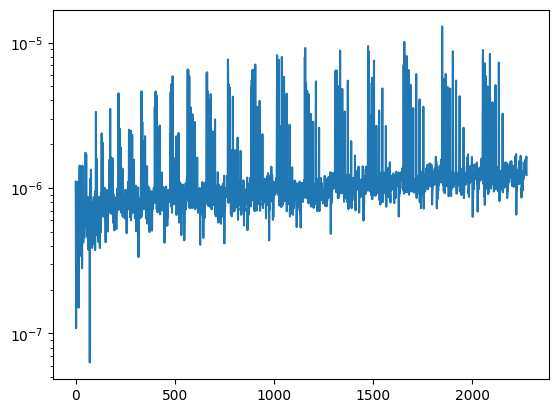

# BFast
A fast GPU based bispectrum estimator implemented with jax.

It contains a fast, more memory heavy algorithm, that can compute the bispectrum of 2276 triangle configurations in a 256^3 box in less than a second on a V100/A100, using float32 precision (~2x for float64).

There is also a slower, memory efficient algorithm for higher resolution grids or more bins. It computes the same 2276 triangle configurations in a 512^3 box in around 35 (70) seconds on an A100 (V100), using float32 precision (~2x for float64).

Requirements:
- numpy
- jax
- scan_tqdm
- matplotlib (for example notebook)

# Demonstration


```python
import os
os.environ['CUDA_VISIBLE_DEVICES'] = '0'

import BFast
import numpy as np
import matplotlib.pyplot as plt
import jax
import jax.numpy as jnp
jax.device_count()
```


    1


```python
BoxSize = 1000.
kF = 2*np.pi/BoxSize
grid = 256
```


```python
df = np.load(f"df_m_256_PCS_z=0.npy")
df.dtype
```


    dtype('float32')


```python
help(BFast.Bk)
```

    Help on function Bk in module BFast.BFast:
    
    Bk(delta, BoxSize, fc, dk, Nbins, triangle_type='All', open_triangles=True, MAS=None, fast=True, precision='float32', file_path='./', verbose=False)
        Computes binned bispectrum of field for given binning and triangles
        
        Parameters:
        -----------
        delta: array
            Real field to compute bispectrum of
        BoxSize:
            Size of box in comoving units (Mpc/h) such that power spectrum has units (Mpc/h)^3 and bispectrum has units (Mpc/h)^6
        fc: float
            Center of first bin in units of the fundamental mode.
        dk: float
            Width of the bin in units of the fundamental mode.
        Nbins: int
            Total number of momentum bins such that bins are given by [(fc + i)±dk/2 for i in range(Nbins)].
        triangle_type: str, optional (default='All')
            Type of triangles to include in the bispectrum calculation. 
            Options: 'All' (include all shapes of triangles),
                     'Squeezed' (include only triangles k_1 < k_2 = k_3), 
                     'Equilateral' (include only triangles k_1 = k_2 = k_3).
        open_triangles: bool, optional (default=True)
            If True, includes triangles of which the bin centers do not form a closed triangles, but still form closed triangles somewhere within the bins (see Biagetti '21)
        MAS: str, optional (default=None)
            Mass Assignment Scheme window function to compensate for (options are NGP,CIC,TSC,PCS)
        fast: bool, optional (default=True)
            If True, uses the fast algorithm that precomputes all bins. If False, use the slower algorithm for larger grid-size and/or Nbins.
        precision: str, optional (default='float32')
            Precision of the computation, affects the speed of the algorithm
        file_path: str, optional (default='./')
            Where to find/save counts file
        verbose: bool, optional (default=False)
            If True, print progress statements (only for slow algorithm)
        
        Returns:
        --------
        result: numpy.ndarray
            An array of shape (len(counts['bin_centers']),8) containing the bispectrum and related information.
            The columns contain: {bin centers in units of kF, P(k1), P(k2), P(k3), B(k1,k2,k3), number of triangles in bin}
            
        Notes:
        --------
        The first time the computation for a certain binning is being done, 
        this function will first compute the necessary mode counts for power spectrum and bispectrum normalization. 
        This is saved in a file in the local directory for later use, when measuring from other density fields but with the same binning.
    


```python
%time Bks_32 = BFast.Bk(df,BoxSize,3.,3.,27,'All',MAS='PCS',fast=True,precision='float32',verbose=True)
%time Bks_64 = BFast.Bk(df,BoxSize,3.,3.,27,'All',MAS='PCS',fast=True,precision='float64',verbose=True)
```

    No counts file found, computing this first!
    Considering 2276 Triangle Configurations (All), with kmax = 0.5184
    Saved Triangle Counts to ./BFast_BkCounts_Grid256_BoxSize1000.00_BinSize3.00kF_FirstCenter3.00kF_NumBins27_TriangleTypeAll_OpenTrianglesTrue_Precisionfloat32.npy
    CPU times: user 3.77 s, sys: 704 ms, total: 4.47 s
    Wall time: 6.93 s
    No counts file found, computing this first!
    Considering 2276 Triangle Configurations (All), with kmax = 0.5184
    Saved Triangle Counts to ./BFast_BkCounts_Grid256_BoxSize1000.00_BinSize3.00kF_FirstCenter3.00kF_NumBins27_TriangleTypeAll_OpenTrianglesTrue_Precisionfloat64.npy
    CPU times: user 1.99 s, sys: 725 ms, total: 2.72 s
    Wall time: 3.4 s


```python
plt.semilogy(Bks_32[:,-2])
```


    [<matplotlib.lines.Line2D at 0x7f383421b0d0>]


    

    


## The first time jax compiles certain parts and compute triangle counts, a next call is blazing fast:


```python
%time Bks_32 = BFast.Bk(df,BoxSize,3.,3.,27,'All',MAS='PCS',fast=True,precision='float32',verbose=True)
%time Bks_64 = BFast.Bk(df,BoxSize,3.,3.,27,'All',MAS='PCS',fast=True,precision='float64',verbose=True)
```

    Loading Counts from ./BFast_BkCounts_Grid256_BoxSize1000.00_BinSize3.00kF_FirstCenter3.00kF_NumBins27_TriangleTypeAll_OpenTrianglesTrue_Precisionfloat32.npy
    Considering 2276 Triangle Configurations (All), with kmax = 0.5184
    CPU times: user 571 ms, sys: 173 ms, total: 745 ms
    Wall time: 636 ms
    Loading Counts from ./BFast_BkCounts_Grid256_BoxSize1000.00_BinSize3.00kF_FirstCenter3.00kF_NumBins27_TriangleTypeAll_OpenTrianglesTrue_Precisionfloat64.npy
    Considering 2276 Triangle Configurations (All), with kmax = 0.5184
    CPU times: user 725 ms, sys: 322 ms, total: 1.05 s
    Wall time: 942 ms


## Float32 precision is very accurate but twice as fast:


```python
plt.semilogy(np.abs((Bks_32[:,-2]-Bks_64[:,-2])/Bks_64[:,-2]))
```


    [<matplotlib.lines.Line2D at 0x7f382c130070>]


    

    


## There is also a slower but more memory friendly algorithm for larger boxes or more bins


```python
%time Bks_32_slow = BFast.Bk(df,BoxSize,3.,3.,27,'All',MAS='PCS',fast=False,precision='float32',verbose=True)
%time Bks_64_slow = BFast.Bk(df,BoxSize,3.,3.,27,'All',MAS='PCS',fast=False,precision='float64',verbose=True)
```

    Loading Counts from ./BFast_BkCounts_Grid256_BoxSize1000.00_BinSize3.00kF_FirstCenter3.00kF_NumBins27_TriangleTypeAll_OpenTrianglesTrue_Precisionfloat32.npy
    Considering 2276 Triangle Configurations (All), with kmax = 0.5184


      0%|          | 0/27 [00:00<?, ?it/s]


      0%|          | 0/2276 [00:00<?, ?it/s]


    CPU times: user 3.49 s, sys: 93 ms, total: 3.58 s
    Wall time: 3.66 s
    Loading Counts from ./BFast_BkCounts_Grid256_BoxSize1000.00_BinSize3.00kF_FirstCenter3.00kF_NumBins27_TriangleTypeAll_OpenTrianglesTrue_Precisionfloat64.npy
    Considering 2276 Triangle Configurations (All), with kmax = 0.5184


      0%|          | 0/27 [00:00<?, ?it/s]


      0%|          | 0/2276 [00:00<?, ?it/s]


    CPU times: user 5.17 s, sys: 77.2 ms, total: 5.25 s
    Wall time: 5.06 s


## Again, Float32 precision is very accurate but twice as fast:


```python
plt.semilogy(np.abs((Bks_32_slow[:,-2]-Bks_64_slow[:,-2])/Bks_64_slow[:,-2]))
```


    [<matplotlib.lines.Line2D at 0x7f38046b17b0>]


    

    


## There is also a power spectrum method with a binning of kF:


```python
help(BFast.Pk)
```

    Help on function Pk in module BFast.BFast:
    
    Pk(delta, BoxSize, MAS=None, left_inclusive=True, precision='float32')
        Computes binned bispectrum of field for given binning and triangles
        
        Parameters:
        -----------
        delta: array
            Real field to compute powerspectrum of
        BoxSize:
            Size of box in comoving units (Mpc/h) such that power spectrum has units (Mpc/h)^3 and bispectrum has units (Mpc/h)^6
        MAS: str, optional (default=None)
            Mass Assignment Scheme window function to compensate for (options are NGP,CIC,TSC,PCS)
        left_inclusive: bool, optional (default=True)
            If True, uses left-inclusive bins. If False, uses right-inclusive bins instead.
        
        Returns:
        --------
        result: numpy.ndarray
            An array of shape (Nbins,3) containing the power spectrum and related information.
            The columns contain: {mean k of the bin, P(k1), number of modes in bin}
    


```python
Pks_32_left = BFast.Pk(df,1000.,MAS='PCS',left_inclusive=True,precision='float32')
Pks_32_right = BFast.Pk(df,1000.,MAS='PCS',left_inclusive=False,precision='float32')
Pks_64_left = BFast.Pk(df,1000.,MAS='PCS',left_inclusive=True,precision='float64')
Pks_64_right = BFast.Pk(df,1000.,MAS='PCS',left_inclusive=False,precision='float64')

plt.loglog(Pks_32_left[:,0],Pks_32_left[:,1])
plt.loglog(Pks_32_right[:,0],Pks_32_right[:,1])
```


    [<matplotlib.lines.Line2D at 0x7f38044d2b60>]


    

    


```python
%time Pks_32_left = BFast.Pk(df,1000.,MAS='PCS',left_inclusive=True,precision='float32')
%time Pks_32_right = BFast.Pk(df,1000.,MAS='PCS',left_inclusive=False,precision='float32')
%time Pks_64_left = BFast.Pk(df,1000.,MAS='PCS',left_inclusive=True,precision='float64')
%time Pks_64_right = BFast.Pk(df,1000.,MAS='PCS',left_inclusive=False,precision='float64')
```

    CPU times: user 381 ms, sys: 49.7 ms, total: 431 ms
    Wall time: 349 ms
    CPU times: user 386 ms, sys: 44.1 ms, total: 430 ms
    Wall time: 356 ms
    CPU times: user 443 ms, sys: 60.1 ms, total: 503 ms
    Wall time: 419 ms
    CPU times: user 435 ms, sys: 55.5 ms, total: 491 ms
    Wall time: 416 ms


## Float32 precision is very accurate, but the speed up is minimal/none in this case (on this grid size!)


```python
plt.loglog(Pks_64_left[:,0],np.abs((Pks_32_left[:,-2]-Pks_64_left[:,-2])/Pks_64_left[:,-2]))
plt.show()
plt.loglog(Pks_64_right[:,0],np.abs((Pks_32_right[:,-2]-Pks_64_right[:,-2])/Pks_64_right[:,-2]))
plt.show()
```


    

    


    

    

